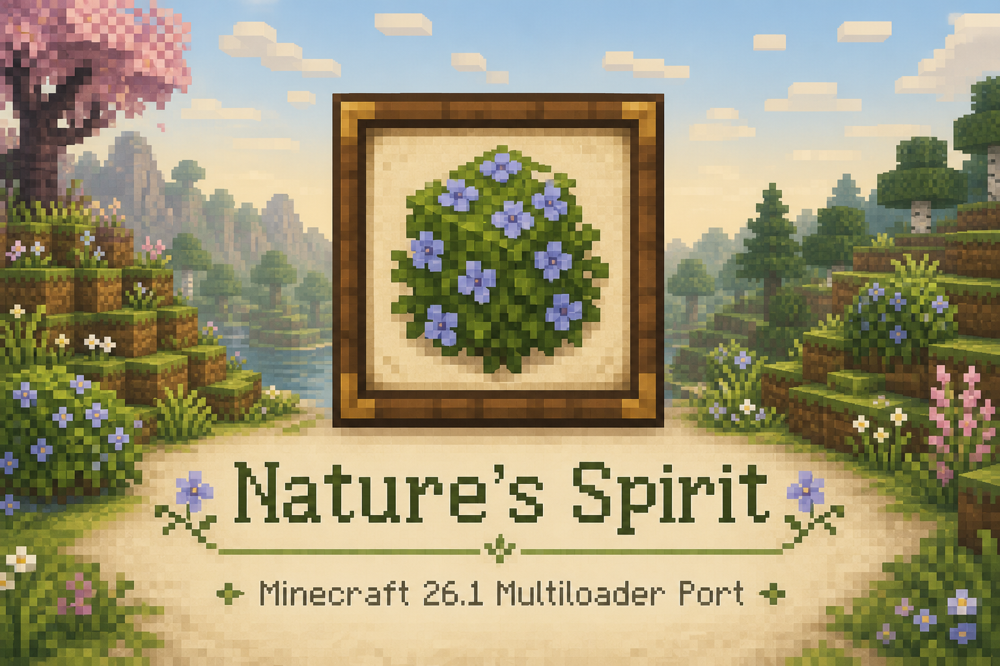

<div align="center">



# Nature's Spirit — Minecraft 26.1

Fabric · NeoForge

<br/>

[](https://www.minecraft.net/)
[](https://adoptium.net/)
[](https://fabricmc.net/)
[](https://neoforged.net/)
[](https://modrinth.com/mod/lithostitched)

[](https://modrinth.com/mod/natures-spirit)
[](https://www.curseforge.com/minecraft/mc-mods/natures-spirit)
[](https://astonishing-chord-210.notion.site/194f058bb4ac80c2979fdfe22fb8010e)
[](https://discord.gg/T6X8KGyt5C)

<br/>

> **This is not an official Team Hibiscus release.**  
> It is a **26.1-focused port / maintenance branch** built so Nature's Spirit can run on the new Minecraft generation while staying faithful to upstream design.

</div>

---

## About

Nature's Spirit expands Minecraft's overworld with biomes, blocks, and items that deepen vanilla immersion — from blooming deserts and grassy marshes to pastel chalk, dyeable kaolin, and a richer building palette.

This repository packages that experience for **Minecraft 26.1** as a **multiloader** project:

| Loader | Status | Artifact |
|--------|--------|----------|
| **Fabric** | Supported | `natures_spirit-fabric-2.3.0+26.1.jar` |
| **NeoForge** | Supported | `natures_spirit-neoforge-2.3.0+26.1.jar` |

Worldgen integration uses **[Lithostitched](https://modrinth.com/mod/lithostitched)** climate-region injectors (Terra Ferax / Flava / Laeta / Mater / Solaris) so Nature's Spirit can coexist with packs like **Terralith**, rather than rewriting foreign biomes by hand.

---

## Requirements

| Dependency | Version / notes |
|------------|-----------------|
| Minecraft | **26.1** |
| Java | **25+** |
| Fabric Loader | `>= 0.19.5` |
| Fabric API | `0.145.1+26.1` (or matching `+26.1` build) |
| NeoForge | `26.1.0.19-beta` (pinned for MC 26.1) |
| Lithostitched | `>= 1.7.13` (**required**) |

---

## Highlights in this branch

### Multiloader reliability
- NeoForge cauldron registration works on **26.1.0.x** without requiring NeoForge 26.1.1+ APIs
- Shared `common` module with Fabric / NeoForge loaders

### Worldgen polish
- Meadow feature-order fix for Terralith + Lithostitched coexistence
- Softer hot/cold snow borders at biome edges
- Optional Terralith plant sprinkle (unique feature IDs; only when Terralith is present)

### Content / quality
- Asset fixes (pizza model, water plants, Iris marigold mapping)
- Tundra precipitation enabled
- Explorer-friendly config defaults and comments

Full detail lives in [`CHANGELOG.md`](./CHANGELOG.md).

---

## Build

```bash
# Fabric
./gradlew :fabric:jar

# NeoForge
./gradlew :neoforge:jar
```

Outputs:

- `fabric/build/libs/natures_spirit-fabric-2.3.0+26.1.jar`
- `neoforge/build/libs/natures_spirit-neoforge-2.3.0+26.1.jar`

> Prefer loader-specific tasks. A blanket `./gradlew build` may hit unrelated tooling noise depending on environment.

---

## Project layout

```
├── common/          Shared content, worldgen, config
├── fabric/          Fabric entrypoints & packaging
├── neoforge/        NeoForge entrypoints & packaging
├── buildSrc/        Multiloader Gradle conventions
├── .github/images/  README banner + logo
├── gradle.properties
└── settings.gradle
```

## Credits

- **Team Hibiscus** — authors of Nature's Spirit  
  Original projects: [NaturesSpirit](https://github.com/Team-Hibiscus/NaturesSpirit) · [NatureSpiritForge](https://github.com/Team-Hibiscus/NatureSpiritForge)
- **Lithostitched** — biome / climate injection used for 26.1 worldgen blend

This port does **not** claim ownership of Nature's Spirit. All rights remain with Team Hibiscus under their license. Please support the official Modrinth / CurseForge pages and Discord.

README banner/logo assets live in [`.github/images/`](.github/images/) and follow Team Hibiscus's flowering-azalea icon theme for this 26.1 port page.

---

## License

Nature's Spirit is licensed under Team Hibiscus's project license (All Rights Reserved / project-specific terms as published upstream).  
This 26.1 port is distributed for compatibility and upstream contribution purposes — respect the original license when redistributing builds or assets.

---

<div align="center">

**Made for Minecraft 26.1** · Multiloader

</div>
